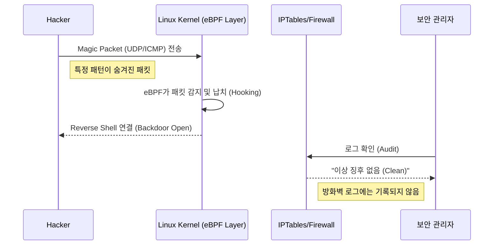

## 1. 서론: 4년의 침묵, 그리고 드러난 민낯

2025년 4월, 대한민국 통신 3사(SKT, KT, LGU+)의 보안이 뚫렸습니다.
해커는 2021년부터 2025년까지 무려 **4년(1,351일)** 동안 우리 안방에 살림을 차렸고, 통신사의 핵심 자산인 **USIM 인증키**까지 탈취했습니다.

과거 2008년 옥션 사태, 2011년 네이트 사태, 2014년 카드사 유출 사태를 겪으며 수없이 많은 대책이 쏟아졌지만, 2025년의 우리는 왜 더 치명적이고 더 방어하기 힘든 보안 사고를 맞이하게 되었을까요?

본 리포트에서는 이번 사태의 **기술적 원인(Micro)**을 분석하고, 나아가 왜 기업은 보안에 실패할 수밖에 없었는지, 그리고 왜 그 피해는 고스란히 이용자에게 전가되는지 **구조적 원인(Macro)**을 엔지니어의 시각으로 해부합니다.

## 2. 기술적 분석: 방어자는 왜 공격자를 이길 수 없었나?

### 2.1. 공격 기술의 진화: 커널 레벨의 은신 (BPFDoor)
과거의 해킹이 웹 취약점(SQL Injection, Webshell)을 노린 '애플리케이션 레벨'의 공격이었다면, 이번 공격은 **OS 커널(Kernel)**을 장악했습니다.

해커들은 리눅스의 **eBPF(Extended Berkeley Packet Filter)** 기술을 악용한 **BPFDoor**를 사용했습니다.

* **기존 방어의 한계:** 보안 장비(WAF, IPS)와 방화벽(`iptables`)은 주로 사용자 영역(User Space)이나 네트워크 스택 상단을 감시합니다.
* **공격의 고도화:** BPFDoor는 패킷이 방화벽에 도달하기도 전에 **Raw Socket** 단계에서 가로챕니다. 즉, 보안 담당자의 모니터에는 '정상 트래픽'만 보입니다.

### 2.2. 레거시(Legacy)의 역습: 평문 저장의 죄악
USIM 인증키와 같은 민감 정보는 **HSM(Hardware Security Module)**에 격리 보관하거나, 최소한 DB 내에서 암호화(Encryption)되어야 합니다.
하지만 이번 사태에서 데이터는 **평문(Plaintext)**으로 관리되었습니다.

이는 몰라서 안 한 것이 아닙니다.
수십 년 된 레거시 시스템에서 암복호화 로직을 추가할 경우 발생할 **Latency(지연 시간)**와 **장애 가능성**을 두려워한, 전형적인 **'가용성(Availability) 우선주의'**가 빚어낸 참사입니다.

## 3. 구조적 심층 분석: 왜 문제는 반복되고 심화되는가?

9년 차 현업 개발자로서, 저는 이 문제를 단순한 기술적 실수가 아닌 **산업 구조적 모순**으로 바라봅니다.

### 3.1. 보안 극장 (Security Theater)과 컴플라이언스의 함정
기업들은 매년 수억 원을 들여 **ISMS-P(정보보호 및 개인정보보호 관리체계)** 인증을 유지합니다.
하지만 인증 심사는 "규정된 절차를 따르고 있는가?"를 볼 뿐, "지능형 해커를 막을 수 있는가?"를 검증하지 못합니다.

기업은 인증 마크를 획득하는 순간 **"우리는 할 만큼 했다(Due Diligence)"**라는 면죄부를 얻습니다. 실질적인 보안 강화(Red Teaming)보다는, 감사(Audit)를 통과하기 위한 **'보안 연극(Security Theater)'**에 리소스가 집중되는 현상이 반복됩니다.

### 3.2. 모럴 해저드: 보안 투자비용 > 사고 수습비용
경제학적으로 볼 때, 기업에게 보안은 '비용'입니다.

$$ Cost(Security) > Cost(Fine) + Cost(Compensation) $$

현재 대한민국의 법체계에서 개인정보 유출 시 기업이 부담해야 할 과징금과 손해배상액은, 완벽한 보안 시스템을 구축하고 유지하는 비용보다 현저히 낮습니다.
경영진 입장에서 보안 사고는 **'막아야 할 재난'**이 아니라, **'발생하면 돈으로 메우면 되는 리스크'**로 계산됩니다. 이 **모럴 해저드(Moral Hazard)**가 해결되지 않는 한, 보안 예산은 늘 후순위로 밀립니다.

### 3.3. 레거시 시스템의 락인(Lock-in)과 기술 부채
통신사는 거대한 레거시 시스템 위에서 돌아갑니다. 20년 전 구축된 코어 망, 10년 전 도입된 빌링 시스템이 여전히 현역입니다.
신규 보안 기술(Zero Trust, Cloud Native Security)을 도입하려면 밑바닥부터 뜯어고쳐야 하는데, 이는 **"잘 돌아가는 시스템을 건드려 장애를 낼 수 있다"**는 공포 때문에 번번이 무산됩니다.
결국 덧대기식 보안(Patchwork)만 반복하다, 구조적 취약점이 터진 것입니다.

## 4. 피해의 비대칭성: 왜 이용자만 고통받는가?

기술은 발전했는데 이용자는 더 취약해졌습니다.

1.  **정보의 비대칭:** 해킹이 발생해도 기업이 발표하기 전까지(이번엔 4년) 이용자는 알 방법이 없습니다. 내 정보가 털린 줄도 모르고 스미싱 문자를 클릭하게 됩니다.
2.  **피해 입증의 책임:** 법원은 이용자가 "이 해킹 사고 때문에 내가 보이스피싱을 당했다"는 인과관계를 입증하라고 요구합니다. 로그 데이터도 없는 개인이 이를 증명하는 것은 불가능합니다.
3.  **락인 효과 (Lock-in):** 통신사는 필수재입니다. 보안이 털렸다고 해서 당장 번호를 바꾸거나 통신을 끊을 수 없습니다. 기업은 고객이 떠나지 않을 것을 알기에 보안에 소홀합니다.

## 5. 제언 및 결론 (Proposal)

우리는 이제 '사과문'과 '재발 방지 대책'이라는 클리셰에 지쳤습니다.
9년 차 엔지니어이자 정보관리기술사 수험생으로서, 다음과 같은 근본적인 변화를 제언합니다.

### 5.1. 기술적 제언: Zero Trust와 데이터 중심 보안
* **Zero Trust Architecture:** "내부망은 안전하다"는 전제를 폐기해야 합니다. 모든 트래픽은 끊임없이 검증되어야 합니다.
* **Data-Centric Security:** 방화벽(경계)을 지키는 것보다 데이터 자체(암호화)를 지키는 것이 최후의 보루입니다. DB 성능 저하를 핑계로 암호화를 미루는 것은 더 이상 용납될 수 없습니다.

### 5.2. 정책적 제언: 징벌적 손해배상과 입증 책임 전환
* **징벌적 손해배상:** 보안 사고가 났을 때 기업의 존립이 위태로울 정도의 강력한 과징금(GDPR 수준, 매출액 기반)을 부과하여, 보안 투자가 비용 절감보다 우선순위가 되도록 강제해야 합니다.
* **입증 책임 전환:** 이용자가 피해를 증명하는 것이 아니라, 기업이 **"우리는 기술적으로 완벽하게 방어했음"**을 증명하지 못하면 배상하도록 법리를 전환해야 합니다.

### 5.3. 맺음말
2025년의 통신 대란은 기술의 실패가 아니라 **거버넌스의 실패**입니다.
4년 동안 우리 곁에 숨어 있던 해커보다 더 무서운 것은, **"어차피 털려도 벌금 좀 내면 그만"**이라고 생각하는 시스템의 안일함입니다.

개발자인 우리는 코드 한 줄을 짤 때마다 보안을 고민해야 하며,
사회는 기업이 보안을 '비용'이 아닌 '생존'으로 인식하도록 압박해야 합니다.

> *"Security is not a feature, it's a state of mind."*
