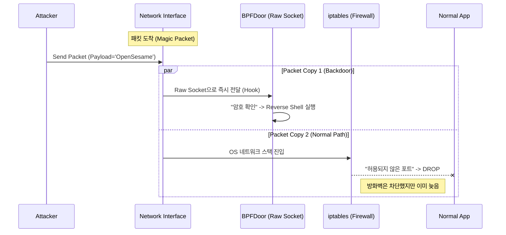

## 1. 개요 (Overview)

최근 발생한 대규모 통신사 침해 사고 조사 과정에서 **'BPFDoor'**라는 고도화된 백도어가 핵심적인 역할을 한 것으로 밝혀졌다.
이 악성코드가 악명 높은 이유는 시스템 관리자가 사용하는 표준 모니터링 도구(`netstat`, `ss`)나 네트워크 방화벽(`iptables`, `firewalld`)을 완벽하게 우회하기 때문이다.

본 포스팅에서는 BPFDoor가 어떻게 OS의 감시망을 회피하는지 **리눅스 커널 네트워크 스택(Linux Kernel Network Stack)** 관점에서 분석하고, 이를 탐지하고 방어하기 위한 엔지니어링 대응 방안을 기술한다.

## 2. BPFDoor란 무엇인가?

**BPFDoor**는 리눅스의 **BPF(Berkeley Packet Filter)** 기술을 악용하여 만들어진 수동형 백도어(Passive Backdoor)다.
일반적인 백도어는 특정 포트(예: 4444)를 열고 `LISTEN` 상태로 대기하지만, BPFDoor는 포트를 열지 않고 네트워크 인터페이스의 모든 패킷을 도청(Sniffing)하다가 공격자의 신호가 오면 활성화된다.

### 핵심 특징 (Key Features)
1.  **No Open Ports:** `netstat -antp`로 조회해도 `LISTEN` 중인 포트가 나타나지 않는다.
2.  **Firewall Bypass:** 로컬 방화벽(`iptables`)보다 낮은 레벨(Raw Socket)에서 패킷을 가로챈다.
3.  **Process Masquerading:** 프로세스 이름을 `/sbin/udevd`, `/usr/lib/systemd/systemd-journald` 등 정상적인 시스템 데몬으로 위장한다.
4.  **Anti-Forensics:** `/dev/shm`과 같은 메모리 기반 파일 시스템에서 실행 후 즉시 삭제(Self-delete)하여 디스크 흔적을 최소화한다.

## 3. 기술적 심층 분석 (Technical Deep Dive)

BPFDoor가 탐지되지 않는 핵심 원리는 **Raw Socket**과 **BPF Filter**의 조합에 있다.

### 3.1. Raw Socket을 이용한 패킷 하이재킹
일반적인 웹 서버는 `SOCK_STREAM` (TCP) 소켓을 사용한다. 이 경우 패킷은 OS의 네트워크 스택(방화벽 포함)을 차례대로 통과해야 애플리케이션에 도달한다.
반면 BPFDoor는 `AF_PACKET`, `SOCK_RAW` 타입을 사용하여 **Raw Socket**을 생성한다.

```c
/* BPFDoor 소켓 생성 코드 (Conceptual) */
int sock = socket(AF_PACKET, SOCK_RAW, htons(ETH_P_ALL));
```

이렇게 생성된 소켓은 네트워크 드라이버(NIC Driver)에서 패킷이 커널로 올라오는 즉시, **iptables나 nftables와 같은 방화벽 체인을 거치기 전**에 패킷의 복사본을 수신한다.

### 3.2. BPF Filter와 Magic Packet
모든 패킷을 스니핑하면 CPU 부하가 증가하여 발각될 위험이 있다. 따라서 BPFDoor는 **BPF(Berkeley Packet Filter)**를 소켓에 부착(`SO_ATTACH_FILTER`)하여 특정 조건의 패킷만 필터링한다.

공격자는 특정한 **매직 패킷(Magic Packet)**, 즉 비밀번호가 담긴 패킷(UDP/ICMP 등)을 보낸다. BPFDoor는 커널 레벨에서 오직 이 패킷만 필터링하여 받아들이고, 쉘(Shell)을 실행한다.



위 다이어그램에서 볼 수 있듯이, 방화벽(`iptables`)이 패킷을 차단하더라도 **BPFDoor는 이미 그전에 패킷을 수신하고 명령을 수행**한다. 이것이 4년간 탐지되지 않은 기술적 이유다.

## 4. 탐지 및 대응 방안 (Mitigation Strategy)

전통적인 도구로는 탐지가 어렵지만, BPFDoor도 시스템 리소스를 사용하는 프로세스이기에 흔적을 남긴다.

### 4.1. 탐지 방법 (Detection)

#### A. Raw Socket 상태 분석
일반적인 애플리케이션은 Raw Socket을 잘 사용하지 않는다. `lsof` 또는 `ss` 명령어를 사용하여 `PACKET` 타입의 소켓을 점유 중인 프로세스를 전수 조사해야 한다.

```bash
# 1. Raw Socket을 사용 중인 프로세스 탐색
# lsof -n | grep PACKET
systemd-j  1234  root  3u  pack  213456  0t0  ALL type=SOCK_RAW

# 2. ss 명령어로 필터링 (Packet Raw 타입)
ss -0 -p
```
DHCP 클라이언트, tcpdump와 같은 정상 프로세스 외에 `udevd`, `syslogd` 등으로 위장한 프로세스가 Raw Socket을 열고 있다면 침해를 강력히 의심해야 한다.

#### B. 바이너리 무결성 검사
BPFDoor는 실행 중인 프로세스 이름을 위장한다. `/proc` 파일 시스템을 통해 실제 실행 파일 경로와 해시값을 대조해야 한다.
* `/proc/[PID]/exe` 심볼릭 링크가 `(deleted)` 상태이거나, `/dev/shm` 등 임시 디렉토리를 가리키는지 확인한다.

### 4.2. 방어 및 완화 (Hardening)

#### A. BPF JIT Hardening
리눅스 커널 설정을 통해 BPF 프로그램의 권한을 제한하고, JIT 컴파일러의 보안을 강화해야 한다.

```bash
# BPF JIT 컴파일러 하드닝 (공격자의 BPF 코드 주입 난이도 상승)
sysctl -w net.core.bpf_jit_harden=2
```

#### B. 엄격한 Outbound 정책 (Egress Filtering)
BPFDoor가 명령을 수신하더라도, 외부의 공격자 서버(C&C)로 **Reverse Shell**을 연결하려면 Outbound 트래픽이 필요하다.
서버의 Outbound 정책을 `Deny All`로 설정하고, 필요한 IP/Port만 허용(Whitelist)한다면, 백도어가 실행되더라도 연결 수립을 차단할 수 있다.

## 5. 결론 (Conclusion)

BPFDoor는 **"방화벽만 믿으면 안전하다"**는 보안의 고정관념을 무너뜨린 사례다. 공격자는 사용자 공간(User Space)을 넘어 커널(Kernel)의 매커니즘을 악용하고 있다.

단순한 솔루션 도입을 넘어, **"내 시스템 내부에서 발생하는 비정상적인 소켓 생성과 커널 레벨의 행위"**를 지속적으로 모니터링할 수 있는 **심층 가시성(Deep Visibility)** 확보가 현대 보안 아키텍처의 필수 요건이다.

$$ \text{Security} = \text{Architecture} \times \text{Visibility} $$
