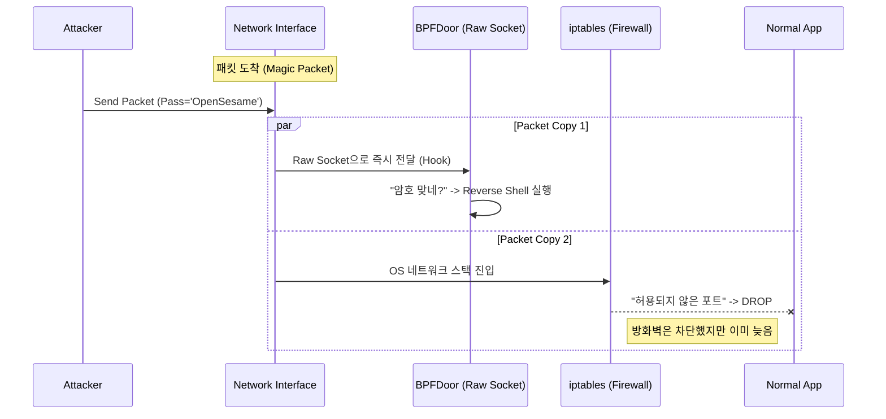

## 1. 개요 (Overview)

최근 통신사, 금융권 등 주요 인프라를 타깃으로 하는 침해 사고 조사 과정에서 **'BPFDoor'**라는 고도화된 백도어가 빈번하게 발견되고 있습니다.
이 악성코드가 악명 높은 이유는 시스템 관리자가 사용하는 일반적인 모니터링 도구(`netstat`, `ss`, `lsof`)나 네트워크 방화벽(`iptables`, `firewalld`)을 완벽하게 우회하기 때문입니다.

9년 차 엔지니어로서, 이 글에서는 BPFDoor가 어떻게 OS의 감시망을 피하는지 **커널 네트워크 스택(Kernel Network Stack)** 관점에서 분석하고, 이를 탐지하고 방어하기 위한 기술적 대응 방안을 정리합니다.

## 2. BPFDoor란 무엇인가?

**BPFDoor**는 리눅스의 **BPF(Berkeley Packet Filter)** 기술을 악용하여 만들어진 수동형 백도어(Passive Backdoor)입니다.
일반적인 백도어는 특정 포트(예: 4444)를 열고 `LISTEN` 상태로 대기하지만, BPFDoor는 포트를 열지 않고 네트워크 인터페이스의 모든 패킷을 도청(Sniffing)하다가 공격자의 신호가 오면 깨어납니다.

### 주요 특징
1.  **No Open Ports:** `netstat -antp`로 조회해도 `LISTEN` 중인 포트가 없습니다.
2.  **Firewall Bypass:** 로컬 방화벽(`iptables`)보다 낮은 레벨에서 패킷을 가로챕니다.
3.  **Process Masquerading:** 프로세스 이름을 `/sbin/udevd`, `/usr/lib/systemd/systemd-journald` 등 정상적인 시스템 데몬으로 위장합니다.
4.  **Anti-Forensics:** `/dev/shm`과 같은 임시 파일 시스템에 존재하다가 실행 즉시 파일을 삭제(Self-delete)하여 디스크 흔적을 남기지 않습니다.

## 3. 기술적 심층 분석 (Technical Deep Dive)

BPFDoor가 탐지되지 않는 핵심 원리는 **Raw Socket**과 **BPF Filter**의 조합에 있습니다.

### 3.1. Raw Socket과 Packet Sniffing
일반적인 웹 서버는 `SOCK_STREAM` (TCP) 소켓을 사용합니다. 이 경우 OS의 네트워크 스택을 차례대로 통과해야 애플리케이션에 도달합니다.
하지만 BPFDoor는 `AF_PACKET`, `SOCK_RAW` 타입을 사용하여 **Raw Socket**을 생성합니다.

```c
// BPFDoor의 소켓 생성 코드 예시 (개념적)
int sock = socket(AF_PACKET, SOCK_RAW, htons(ETH_P_ALL));
```

이렇게 생성된 소켓은 네트워크 드라이버에서 패킷이 올라오자마자 **OS의 네트워크 스택(방화벽 포함)을 거치기 전**에 사본을 가로챌 수 있습니다.

### 3.2. BPF Filter와 Magic Packet
모든 패킷을 다 열어보면 시스템 부하가 걸려 들통이 납니다. 그래서 BPFDoor는 **BPF(Berkeley Packet Filter)**를 소켓에 부착(`SO_ATTACH_FILTER`)합니다.

공격자는 특정한 **매직 패킷(Magic Packet)**, 즉 비밀번호가 담긴 패킷을 보냅니다. BPFDoor는 커널 레벨에서 오직 이 패킷만 필터링하여 받아들입니다.



위 다이어그램처럼, 방화벽(`iptables`)이 패킷을 차단하더라도 **BPFDoor는 이미 그전에 패킷을 수신**했습니다. 이것이 방화벽 우회의 원리입니다.

## 4. 탐지 및 대응 방안 (Mitigation)

`netstat`으로는 보이지 않지만, BPFDoor도 흔적을 남깁니다. 시니어 엔지니어가 수행해야 할 대응 전략입니다.

### 4.1. 탐지 방법 (Detection)

#### A. 소켓(Socket) 상태 심층 분석
`ss` 또는 `lsof` 명령어를 사용하여 `PACKET` 타입의 소켓을 열고 있는 프로세스를 찾아야 합니다.

```bash
# 1. Raw Socket을 사용 중인 프로세스 탐색
# lsof -n | grep PACKET
systemd-j  1234  root  3u  pack  213456  0t0  ALL type=SOCK_RAW

# 2. ss 명령어로 필터링
ss -0 -p | grep BPF
```
정상적인 프로세스(DHCP 클라이언트, tcpdump 등) 외에 낯선 프로세스가 Raw Socket을 점유하고 있다면 의심해야 합니다.

#### B. 프로세스 트리 및 바이너리 검사
BPFDoor는 이름을 위장하지만, `/proc` 파일 시스템에는 진실이 남아 있습니다.
* `/proc/[PID]/exe` 심볼릭 링크가 삭제되었거나(`deleted`), 엉뚱한 경로를 가리키는지 확인합니다.
* 위장된 프로세스 이름(`udevd`)이 실제 시스템 경로(`/sbin/udevd`)의 해시값과 일치하는지 비교합니다.

### 4.2. 방어 및 완화 (Hardening)

#### A. BPF JIT Hardening 활성화
리눅스 커널 설정을 통해 BPF 프로그램의 권한을 제한해야 합니다.

```bash
# BPF JIT 컴파일러 하드닝 (공격자가 BPF 코드를 주입하기 어렵게 만듦)
sysctl -w net.core.bpf_jit_harden=2
```

#### B. 네트워크 세분화 (Network Segmentation)
서버가 외부와 임의의 통신을 하지 못하도록 **Outbound 정책**을 엄격하게 제한해야 합니다. BPFDoor가 명령을 받아도, 외부 C&C 서버로 Reverse Shell을 쏘지 못하면 무용지물입니다.

#### C. EDR / XDR 도입
전통적인 백신(Signature 기반)은 변종 BPFDoor를 잡지 못합니다. 커널 레벨의 행위(Behavior)를 모니터링하는 EDR 솔루션을 통해 "비정상적인 Raw Socket 생성" 행위 자체를 탐지하고 차단해야 합니다.

## 5. 결론 (Insight)

BPFDoor는 **"방화벽만 믿으면 안전하다"**는 우리의 고정관념을 비웃는 위협입니다. 공격자는 사용자 공간(User Space)을 넘어 커널(Kernel) 영역에서 놀고 있습니다.

9년 차 엔지니어로서, 그리고 미래의 기술사로서 제언합니다.
보안은 '경계(Perimeter)'를 지키는 것에서 멈추면 안 됩니다. **"내 시스템 내부에서 발생하는 비정상적인 시스템 콜(System Call)과 소켓 생성"**까지 들여다볼 수 있는 **심층적인 가시성(Deep Visibility)** 확보가 현대 보안의 핵심입니다.

$$ \text{Visibility} \rightarrow \text{Detection} \rightarrow \text{Response} $$
