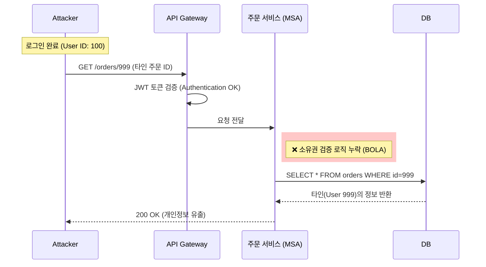

## 1. 서론: 대한민국 IT 신뢰의 붕괴

2025년 11월, 대한민국 IT 생태계를 지탱하던 두 개의 거대한 기둥이 흔들렸다.
'전 국민의 쇼핑 앱' **쿠팡(Coupang)**에서는 타인의 민감한 주문 정보가 무방비로 노출되었고, 국내 1위 가상자산 거래소 **업비트(Upbit)**에서는 약 455억 원 규모의 솔라나(Solana) 코인이 탈취되었다.

두 사건은 공격의 형태(데이터 유출 vs 자산 탈취)와 도메인(Web 2.0 vs Web 3.0)은 다르지만, **"시스템의 편의성과 속도를 위해 보안 무결성을 희생했다"**는 공통된 원인을 공유한다.

본 리포트에서는 9년 차 엔지니어의 관점에서 두 사고의 기술적 원인을 코드 레벨과 아키텍처 레벨에서 심층 해부하고, 재발 방지를 위한 엔지니어링 제언을 담았다.

---

## 2. Part I. 쿠팡 사태: 세션의 혼선과 인가(Authorization)의 실패

### 2.1. 사고의 재구성
사용자가 쿠팡 앱의 '마이페이지'나 '배송 조회' 탭에 접근했을 때, 본인의 정보가 아닌 낯선 사람의 이름, 주소, 전화번호, 구매 내역이 노출되었다. 이는 외부 해커의 DB 침투라기보다는, **애플리케이션 계층(L7)에서의 로직 오류**일 가능성이 매우 높다.

### 2.2. 기술적 원인 분석 1: Redis Session Key Collision (추정)
대규모 트래픽을 처리하는 커머스는 세션 관리를 위해 Redis와 같은 In-memory DB를 사용한다. 만약 동시 접속자 처리를 위해 세션 ID 생성 알고리즘을 변경했거나, 캐싱 레이어(CDN/Edge) 설정 오류가 발생했다면 **'세션 꼬임(Session Crossover)'** 현상이 발생할 수 있다.

* **정상 상황:** `User_A` $\rightarrow$ `Session_ID_A` $\rightarrow$ `Redis_Key_A` $\rightarrow$ `User_A_Data`
* **사고 상황:** `User_B` $\rightarrow$ `Session_ID_B` $\rightarrow$ **(Hash Collision / Caching Error)** $\rightarrow$ `User_A_Data` 반환

### 2.3. 기술적 원인 분석 2: BOLA (Broken Object Level Authorization)
더 근본적인 문제는 API 보안 취약점인 **BOLA(객체 수준 권한 부여 실패)**다. 일명 **IDOR(Insecure Direct Object Reference)**라고도 불린다.

빠른 개발을 위해 마이크로서비스(MSA)를 도입하면서, **API Gateway** 단계에서 인증(Authentication, "누구인가?")은 수행했지만, 각 **Microservice** 내부에서 인가(Authorization, "이 데이터를 볼 권한이 있는가?") 검증을 누락한 경우다.

#### [Vulnerable Code Example]
```java
// 취약한 컨트롤러 예시 (검증 로직 부재)
@GetMapping("/api/orders/{orderId}")
public ResponseEntity<Order> getOrder(@PathVariable Long orderId) {
    // ❌ SECURITY HOLE: 현재 로그인한 유저가 orderId의 주인인지 확인하지 않음
    return ResponseEntity.ok(orderRepository.findById(orderId));
}
```

#### [Secure Code Example]
```java
// 보안이 적용된 컨트롤러
@GetMapping("/api/orders/{orderId}")
public ResponseEntity<Order> getOrder(@AuthenticationPrincipal User user, @PathVariable Long orderId) {
    Order order = orderRepository.findById(orderId);
    
    // ✅ 소유권 검증 (Authorization)
    if (!order.getUserId().equals(user.getId())) {
        throw new AccessDeniedException("본인의 주문만 조회할 수 있습니다.");
    }
    return ResponseEntity.ok(order);
}
```



---

## 3. Part II. 업비트 사태: 핫월렛의 딜레마와 키 관리 실패

### 3.1. 사고의 재구성
업비트의 솔라나(Solana) 핫월렛에서 455억 원 상당의 코인이 해커의 지갑으로 전송되었다. 업비트는 이를 '이상 입출금'으로 감지하고 입출금을 중단했지만, 솔라나 네트워크의 빠른 완결성(Finality)으로 인해 자산 이동은 수초 만에 완료되었다.

### 3.2. 기술적 원인 분석: 핫월렛(Hot Wallet) 구조의 취약성
거래소는 빠른 입출금을 위해 개인키(Private Key)가 온라인 상태인 **핫월렛**을 사용한다. 핫월렛 서버는 필연적으로 인터넷에 연결되어 있으며, 이는 해커들의 주 공격 대상(APT)이 된다.

$$ \text{Security Level}_{HotWallet} \ll \text{Security Level}_{ColdWallet} $$

해커가 핫월렛 서버의 **루트 권한(Root Privilege)**을 획득하거나, 서명 모듈(Signing Module)을 메모리 덤프 방식으로 탈취했다면, 개인키 파일이 암호화되어 있어도 복호화하여 유출할 수 있다.

### 3.3. 솔라나(Solana) 네트워크의 특수성
이더리움이나 비트코인은 트랜잭션 전송 후 컨펌(Confirm)까지 수분의 시간이 걸려, 그사이 거래소가 FDS(이상거래탐지)를 통해 전파를 차단하거나 취소(RBF)를 시도할 여지가 있다.
하지만 솔라나는 **PoH (Proof of History)** 알고리즘을 통해 초당 수천 건(TPS)을 처리한다. 해커는 이 '속도'를 악용해 탐지 시스템이 반응하기도 전에 자금을 세탁 경로(Mixer)로 이동시켰다.

### 3.4. Multi-sig와 MPC의 부재 혹은 무력화
통상적으로 거액의 자산은 **다중 서명(Multi-sig)** 지갑에 보관한다. $N$개의 키 중 $M$개가 서명해야 출금되는 방식이다.
이번 사고는 다음 두 가지 중 하나다.
1.  **편의성 추구:** 핫월렛에 Multi-sig를 적용하지 않고 단일 키(Single Key)로 운영했다.
2.  **MPC 키 쉐어 탈취:** MPC(Multi-Party Computation)를 썼더라도, 분산된 키 쉐어(Key Share)가 보관된 서버들이 동시에 해킹당했다.

```mermaid
flowchart TD
    subgraph Vulnerable_HotWallet [기존 핫월렛 구조]
        Server[온라인 서버] -->|직접 서명| PK[단일 개인키 (Single Key)]
        PK -->|탈취 가능| Hacker
    end

    subgraph Secure_MPC [MPC 기반 월렛 구조]
        App[출금 요청] --> Share1[Key Share A (서버)]
        App --> Share2[Key Share B (HSM)]
        App --> Share3[Key Share C (관리자 모바일)]
        
        Share1 & Share2 & Share3 -->|프로토콜 연산| Signature[완전한 서명 생성]
        style Share2 fill:#bbf
        style Share3 fill:#bfb
    end
```

---

## 4. 종합 비교 및 구조적 문제 진단

두 사건은 서로 다른 기술 스택 위에서 발생했지만, **'실패의 패턴'**은 놀랍도록 유사하다.

| 비교 항목 | 쿠팡 (Web Application) | 업비트 (Blockchain Infrastructure) |
| :--- | :--- | :--- |
| **핵심 자산** | 고객 개인정보 (Privacy) | 가상 자산 (Financial Asset) |
| **공격 벡터** | API 로직 결함 / 캐싱 오류 | APT 공격 / 개인키 탈취 |
| **실패 원인** | **검증(Authorization)의 부재** | **격리(Isolation)의 실패** |
| **공통점** | **속도(Speed)**를 위해 **보안(Safety)** 단계를 생략하거나 간소화함 |

### 4.1. 속도 지상주의의 폐해
쿠팡은 '로켓 배송'과 빠른 페이지 로딩을 위해 캐싱을 공격적으로 적용했고, 마이크로서비스 간 통신 오버헤드를 줄이기 위해 권한 검증을 느슨하게 했다.
업비트는 고객의 '빠른 입출금' 요구를 맞추기 위해 핫월렛 비중을 높게 유지했고, 복잡한 콜드월렛 이동 절차를 최소화했다.

### 4.2. DevSecOps의 실종
보안은 개발의 마지막 단계에 붙이는 '스티커'가 아니다.
쿠팡의 코드가 배포되기 전 **SAST(정적 분석)** 도구가 BOLA 취약점을 잡았어야 했고, 업비트의 핫월렛 서버는 **Zero Trust** 원칙하에 내부망에서도 철저히 격리되었어야 했다.

---

## 5. 결론 및 엔지니어링 제언 (Conclusion)

2025년의 보안 사고는 우리에게 명확한 기술적 과제를 던진다.

### 5.1. [Web/App] Shift Left & Automated Security
* **IDOR/BOLA 방지:** 모든 API 엔드포인트에 대해 자동화된 **DAST(동적 분석)** 테스트를 CI/CD 파이프라인에 통합해야 한다.
* **Session Consistency:** CDN이나 캐시 서버 설정 시, 사용자 개인화 정보(PII)가 포함된 페이지는 절대 캐싱되지 않도록 `Cache-Control: private, no-store` 헤더를 엄격히 관리해야 한다.

### 5.2. [Blockchain] Trust No One (MPC & HSM)
* **MPC(Multi-Party Computation) 필수화:** 핫월렛이라 할지라도 단일 서버에 온전한 개인키가 존재해서는 안 된다. 키를 수학적으로 쪼개어(Sharding) 서로 다른 물리적 위치(클라우드, 온프레미스, 관리자 단말)에 보관해야 한다.
* **Anomaly Detection (FDS):** 블록체인에 트랜잭션을 전파(Broadcast)하기 전, 별도의 오프라인 검증 모듈이 금액과 수신처를 2차 검증하는 **'지연 출금 시스템'**을 도입해야 한다.

### 5.3. 맺음말
**"보안은 비즈니스의 속도를 늦추는 장애물이 아니라, 그 속도를 감당할 수 있게 하는 안전장치다."**
이 문장이 단순한 슬로건이 아니라, 시스템 아키텍처의 제1원칙(First Principle)이 되어야 할 때다.
