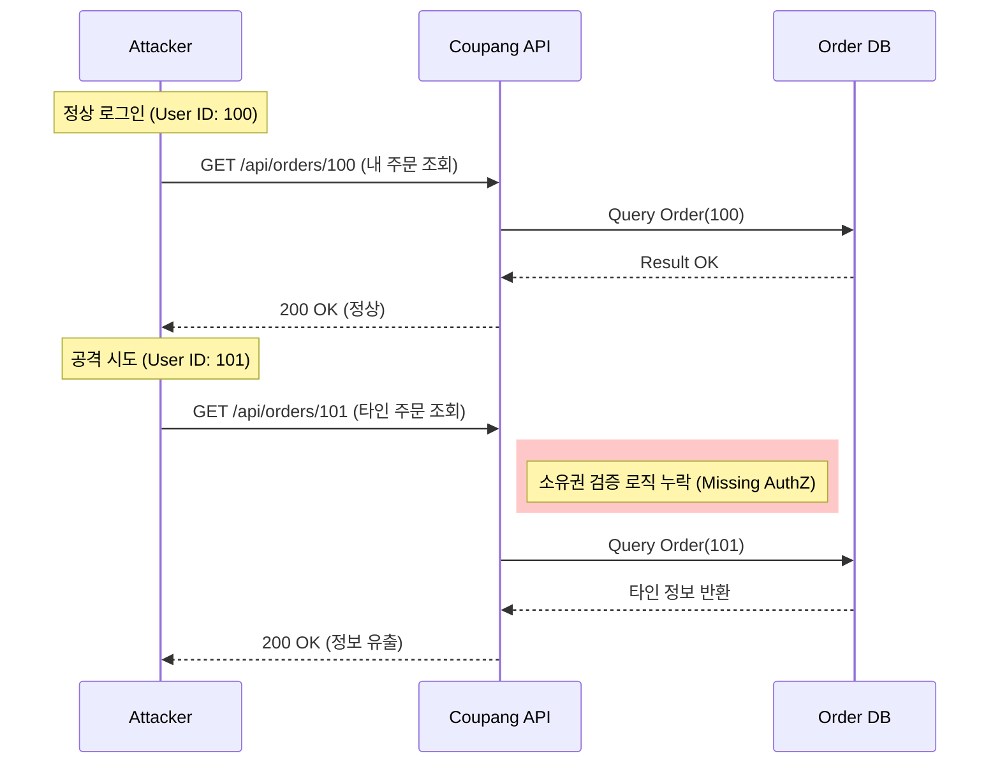

## 1. 개요 (Overview)

2025년 11월은 대한민국 IT 역사상 가장 잔인한 달로 기록될 것이다.
국내 최대 이커머스 **쿠팡(Coupang)**에서는 대규모 고객 개인정보가 유출되었고, 불과 며칠 뒤 국내 1위 가상자산 거래소 **업비트(Upbit)**에서는 약 455억 원 규모의 가상자산이 탈취되었다.

두 사건은 공격 대상과 방식은 달랐지만, **'신뢰 시스템(Trust System)의 붕괴'**라는 공통된 시사점을 던진다.
본 리포트에서는 9년 차 엔지니어의 시각으로 두 사건의 기술적 원인을 해부하고, 이를 관통하는 구조적 문제를 진단한다.

## 2. Case 1: 쿠팡 개인정보 유출 - 편의성이 낳은 대가

### 2.1. 사고 개요
쿠팡 앱 내 '타인의 배송지 정보'와 '주문 내역'이 노출되는 사고가 발생했다. 해커에 의한 직접적인 DB 침투라기보다는, 애플리케이션 로직의 허점을 노린 공격으로 추정된다.

### 2.2. 기술적 원인: BOLA (Broken Object Level Authorization)
가장 유력한 원인은 API 보안의 1순위 취약점인 **BOLA(객체 수준 권한 부여 실패)**, 일명 **IDOR(Insecure Direct Object Reference)**다.

빠른 서비스 배포를 위해 마이크로서비스(MSA)를 확장하는 과정에서, API Gateway 레벨이나 비즈니스 로직에서 **'요청자가 해당 데이터의 주인인지'** 검증하는 로직이 누락된 경우다.

### 2.3. 시사점
이는 복잡한 해킹 기술이 아니다. **기능 구현(Functionality)**에 치중하느라 **보안 검증(Security check)**을 놓친 휴먼 에러이자 프로세스의 실패다. MSA 환경에서 인증(Authentication)과 인가(Authorization)의 분리가 명확하지 않을 때 발생하는 전형적인 사고다.

## 3. Case 2: 업비트 455억 탈취 - 핫월렛의 딜레마

### 3.1. 사고 개요
업비트의 이더리움(ETH) 핫월렛에서 455억 원 상당의 코인이 알 수 없는 지갑으로 이체되었다. 거래소 측은 이를 '이상 거래'로 감지하고 입출금을 중단했지만, 이미 자산은 블록체인 네트워크를 타고 사라진 뒤였다.

### 3.2. 기술적 원인: 프라이빗 키(Private Key) 관리 실패와 APT
블록체인 거래는 **개인키(Private Key)**로 서명(Signing)하는 순간 되돌릴 수 없다. 이번 사고는 핫월렛(Hot Wallet, 온라인에 연결된 지갑)의 개인키가 유출되었거나, 서명 권한을 가진 내부 직원의 PC가 **APT(지능형 지속 위협)** 공격에 당한 것으로 분석된다.

$$ \text{Transaction} = \text{Sign}(\text{Message}, \text{Private Key}_{HotWallet}) $$

해커는 핫월렛 서버에 침투하여 키 자체를 탈취했거나, 정상적인 관리자 도구로 위장한 악성 프로그램을 통해 서명 프로세스를 하이재킹(Hijacking)했을 가능성이 높다.

### 3.3. 시사점: 핫월렛 vs 콜드월렛
편리한 입출금을 위해 핫월렛 비중을 높이면 보안이 취약해지고, 보안을 위해 콜드월렛(Cold Wallet, 오프라인 지갑) 비중을 높이면 유동성이 떨어진다. 이번 사고는 **키 관리 시스템(KMS)의 다중 서명(Multi-sig)** 체계가 무력화되었거나, 내부 통제 절차가 작동하지 않았음을 보여준다.

## 4. 종합 분석: 우리는 무엇을 놓쳤는가?

두 사건은 서로 다른 도메인에서 발생했지만, 근본적인 원인은 맞닿아 있다.

| 구분 | 쿠팡 (E-commerce) | 업비트 (Crypto Exchange) |
| :--- | :--- | :--- |
| **핵심 자산** | 고객 개인정보 (Data) | 가상 자산 (Money) |
| **공격 벡터** | API 취약점 (Application Level) | 키 관리/APT (System/Admin Level) |
| **공통 원인** | **검증 부재 (Zero Trust Fail)** | **내부 통제 실패 (Governance Fail)** |

### 4.1. Zero Trust의 부재
쿠팡은 API 요청자를 맹신했고, 업비트는 내부 관리자(또는 핫월렛 서버)를 맹신했다. "로그인했으니 안전하겠지", "내부망이니 안전하겠지"라는 안일함이 대형 사고로 이어졌다.

### 4.2. 속도와 보안의 트레이드오프
쿠팡의 '로켓 배송'과 업비트의 '빠른 입출금'. 두 기업 모두 **속도(Velocity)**를 최우선 가치로 두면서, 보안이라는 브레이크를 느슨하게 잡았다. 기술 부채(Technical Debt)가 보안 부채(Security Debt)로 전이되어 이자까지 쳐서 돌아온 셈이다.

## 5. 결론 및 제언 (Conclusion)

2025년의 보안 사고는 더 이상 '방화벽' 만으로 막을 수 없다.

1.  **Shift Left Security:** API 개발 단계(Design/Code)에서부터 보안성 검토와 자동화된 취약점 스캔(SAST/DAST)이 필수적이다. (쿠팡 사례 교훈)
2.  **KMS & Governance:** 자산을 다루는 시스템은 그 어떤 관리자도 단독으로 출금/조회할 수 없도록, 기술적 강제 장치(Multi-sig, Quorum)를 둬야 한다. (업비트 사례 교훈)

보안은 '기능'이 아니라 시스템을 지탱하는 '기반'이다. 기반이 무너진 서비스 위에는 그 어떤 혁신도 쌓아올릴 수 없다.
