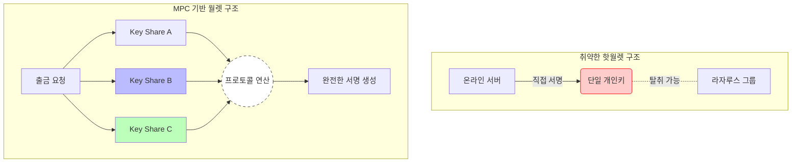
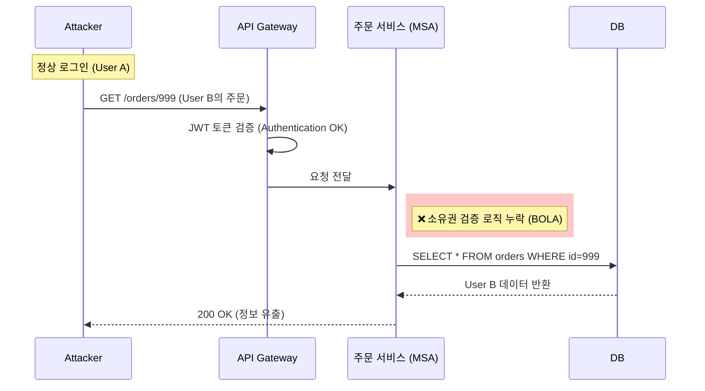

## 1. 서론: 대한민국 IT 신뢰의 붕괴

2025년 11월, 대한민국 IT 생태계를 지탱하던 두 개의 거대한 기둥이 흔들렸다.
'전 국민의 쇼핑 앱' **쿠팡(Coupang)**에서는 타인의 민감한 주문 정보가 무방비로 노출되었고, 국내 1위 가상자산 거래소 **업비트(Upbit)**에서는 약 455억 원 규모의 솔라나(Solana) 코인이 탈취되었다.

두 사건은 공격의 형태(데이터 유출 vs 자산 탈취)는 다르지만, **"시스템의 편의성을 위해 보안 무결성을 희생했다"**는 공통된 원인을 공유한다. 더불어 이번 업비트 사태의 배후로 지목되는 **북한 정찰총국 산하 해킹 조직(Lazarus Group)**의 존재는 이 문제가 단순한 기술적 결함을 넘어선 '사이버 안보 위협'임을 시사한다.

**라자루스의 공격 흐름(Threat Intelligence)**과 두 사고의 **기술적 원인(Root Cause)**을 심층 분석하고, 재발 방지를 위한 엔지니어링 제언을 담았다.

---

## 2. 위협 인텔리전스 (Threat Intelligence): 라자루스의 귀환

이번 사태를 단순한 해킹 사고로 볼 수 없는 이유는 공격 주체의 명확성 때문이다. 북한 라자루스 그룹은 가상자산 거래소를 '국가 자금 조달 창구'로 활용해 왔으며, 그들의 공격은 일회성이 아닌 **조직적 캠페인**이다.

### 2.1. 공격 타임라인: 진화하는 약탈자
그들은 학습하고 진화하며, 규모를 키워왔다.

> **[북한 배후 추정 주요 공격 일지]**
> * **2019년:** **업비트 이더리움 탈취** (34만 ETH, 당시 580억 원).
>   * 특징: 핫월렛 개인키 직접 탈취.
> * **2022년:** **로닌 네트워크 해킹** (약 7,400억 원).
>   * 특징: 개발자를 타깃으로 한 스피어 피싱(APT).
> * **2025년 02월:** **바이비트(Bybit) 해킹** (약 2조 1,800억 원 / 역대 최대).
>   * 특징: FBI 최우선 수배, 믹서(Mixer)를 통한 초고속 세탁.
> * **2025년 11월:** **업비트 솔라나 탈취 (금번 사고)**

### 2.2. 전략적 분석: 성동격서 (Diversion)
보안 전문가들은 쿠팡 사태와 업비트 해킹이 동시다발적으로 일어난 점에 주목한다.
대형 이커머스의 개인정보 유출로 사회적 이목이 쏠리고 KISA 및 보안 인력이 대응에 급급한 틈을 타, 진짜 목표인 금융 자산을 탈취하는 **성동격서(聲東擊西)** 전략일 가능성이 제기된다. 이는 라자루스가 즐겨 쓰는 교란 전술 중 하나다.

---

## 3. Case I. 업비트 사태: 핫월렛과 속도의 딜레마

### 3.1. 사고의 재구성
업비트의 솔라나(Solana) 핫월렛에서 455억 원 상당의 코인이 해커의 지갑으로 전송되었다. 업비트는 이를 감지하고 입출금을 중단했으나, 자산 이동은 수초 만에 완료되었다.

### 3.2. 기술적 원인 1: 핫월렛(Hot Wallet) 구조의 취약성
거래소는 빠른 입출금을 위해 개인키(Private Key)가 온라인 상태인 **핫월렛**을 사용한다. 핫월렛 서버는 필연적으로 인터넷에 연결되어 있으며, 이는 라자루스와 같은 APT 공격 그룹의 주 타깃이 된다.

$$ \text{Risk}_{HotWallet} \propto \frac{\text{Connectivity} \times \text{Asset Value}}{\text{Access Control}} $$

해커가 핫월렛 서버의 **루트 권한(Root Privilege)**을 획득하거나 서명 모듈(Signing Module)을 메모리 덤프 방식으로 장악했다면, 개인키 파일이 암호화되어 있어도 복호화하여 유출할 수 있다.

### 3.3. 기술적 원인 2: 솔라나(Solana)의 특수성 악용
이더리움이나 비트코인은 블록 확정까지 수분이 걸려 대응할 골든타임이 존재한다. 하지만 솔라나는 **PoH(Proof of History)** 알고리즘을 통해 초당 수천 건(TPS)을 처리하며, 수초 내에 완결성(Finality)을 갖는다.
해커는 이 '속도'를 악용해 탐지 시스템(FDS)이 반응하기도 전에 자금을 세탁 경로(Mixer)로 이동시켰다.

### 3.4. 아키텍처 결함: MPC의 부재
현대적인 커스터디 보안의 핵심은 키를 쪼개서 보관하는 **MPC(Multi-Party Computation)** 기술이다.
이번 사고는 핫월렛에 MPC를 적용하지 않고 **단일 키(Single Key)**로 운영했거나, MPC 키 쉐어(Key Share)가 보관된 서버들이 **동일한 네트워크 존**에 있어 동시에 장악당했을 가능성이 크다.



---

## 4. Case II. 쿠팡 사태: BOLA와 내부 로직의 붕괴

업비트가 '외부의 적'에 의해 무너졌다면, 쿠팡은 '내부의 허점'으로 인해 무너졌다.

### 4.1. 기술적 원인 1: Redis Session Key Collision (추정)
대규모 트래픽 처리를 위해 Redis와 같은 In-memory DB를 사용할 때, 세션 ID 생성 알고리즘의 충돌이나 캐싱 레이어(CDN) 설정 오류로 인해 **'세션 꼬임'** 현상이 발생했을 가능성이 있다. 이는 사용자가 타인의 세션으로 로그인된 것처럼 동작하게 만든다.

### 4.2. 기술적 원인 2: BOLA (Broken Object Level Authorization)
더 근본적인 문제는 API 보안 취약점인 **BOLA(객체 수준 권한 부여 실패)**, 일명 **IDOR**다.
API Gateway 단계에서 인증(Authentication)은 수행했지만, 각 마이크로서비스 내부에서 **"이 데이터를 볼 권한이 있는가?"(Authorization)** 검증을 누락한 경우다.

#### [Vulnerable Code Example]
```java
// ❌ 취약한 코드: 주문 ID만 있으면 누구나 조회 가능 (검증 로직 부재)
@GetMapping("/api/orders/{orderId}")
public ResponseEntity<Order> getOrder(@PathVariable Long orderId) {
    return ResponseEntity.ok(orderRepository.findById(orderId));
}
```

#### [Secure Code Example]
```java
// ✅ 안전한 코드: 소유권 검증 (Authorization)
@GetMapping("/api/orders/{orderId}")
public ResponseEntity<Order> getOrder(@AuthenticationPrincipal User user, @PathVariable Long orderId) {
    Order order = orderRepository.findById(orderId);
    if (!order.getUserId().equals(user.getId())) {
        throw new AccessDeniedException("접근 권한이 없습니다.");
    }
    return ResponseEntity.ok(order);
}
```



---

## 5. 종합 비교 및 제언 (Comparison & Proposal)

| 비교 항목 | 쿠팡 (E-commerce) | 업비트 (Crypto Exchange) |
| :--- | :--- | :--- |
| **핵심 자산** | 고객 개인정보 (Privacy) | 가상 자산 (Financial Asset) |
| **위협 주체** | 내부 로직 오류 / 불특정 다수 | **라자루스 (State-sponsored APT)** |
| **실패 원인** | **검증(Authorization)의 부재** | **격리(Isolation)의 실패** |
| **공통점** | **속도(Speed)**를 위해 **보안(Safety)** 단계를 생략하거나 간소화함 |

### 5.1. [Infrastructure] Trust No One (Zero Trust)
라자루스와 같은 APT 그룹을 막기 위해 "내부망은 안전하다"는 전제를 폐기해야 한다.
* **망분리 고도화:** 핫월렛 서버는 물리적으로 분리된 가장 깊은 존(Zone)에 배치하고, 모든 접근 행위에 대해 MFA와 UBA(행위 기반 탐지)를 적용해야 한다.
* **MPC 필수화:** 핫월렛 키는 절대 단일 서버에 존재해선 안 되며, $N$-of-$M$ 방식의 분산 서명 체계를 강제해야 한다.

### 5.2. [Application] Shift Left Security
쿠팡 사태와 같은 BOLA 취약점은 배포 전 단계에서 충분히 막을 수 있다.
* **Automated DAST:** CI/CD 파이프라인에 동적 보안 테스팅(DAST)을 통합하여, 권한 우회 시도를 자동으로 탐지해야 한다.

### 5.3. 맺음말
2019년 580억, 2025년 2조 원, 그리고 이번 455억.
피해 금액은 숫자에 불과하지만, 그 돈이 흘러가는 곳은 명확하다.

우리가 작성하는 코드 한 줄, 서버 권한 설정 하나가 **국가 안보**와 직결될 수 있다.
보안은 비즈니스의 속도를 늦추는 장애물이 아니라, 그 속도를 감당할 수 있게 하는 유일한 안전장치다.

$$ \text{Security} = \text{Technology} \times \text{Vigilance} \times \text{Architecture} $$
