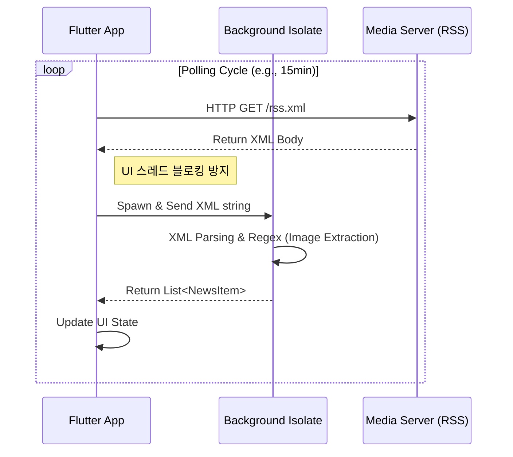

## 1. 서론: 화려한 API 시대, 왜 '고대 유물' RSS인가?

최근 Flutter로 뉴스 애그리게이션(Aggregation) 앱을 개발하며 데이터 소싱 방식을 고민하던 중, `NewsAPI`나 `Mediastack` 같은 최신 REST API 대신 **RSS(Really Simple Syndication)**를 선택했다.

혹자는 RSS를 "2000년대의 유물"이라 부르지만, 엔지니어링 관점에서 RSS는 여전히 **가장 비용 효율적이고, 탈중앙화된 데이터 배포 프로토콜**이다. 본 포스팅에서는 최신 앱 개발 환경에서 RSS가 갖는 기술적 가치와 장단점, 그리고 향후 전망을 심층 분석한다.

## 2. 기술적 심층 분석 (Technical Deep Dive)

### 2.1. RSS의 아키텍처: Pull vs Push
현대적 뉴스 서비스가 FCM(Firebase Cloud Messaging) 등을 이용한 **Push** 방식이라면, RSS는 전형적인 **Pull** 방식의 폴링(Polling) 모델이다.

* **구조:** XML(Extensible Markup Language) 기반의 표준 규격 (RSS 2.0, Atom).
* **동작:** 클라이언트가 정해진 주기로 서버에 `GET` 요청을 보내고, 변경 사항(새로운 `<item>`)을 스스로 감지해야 한다.



### 2.2. Flutter에서의 구현 포인트
Flutter에서 RSS를 다룰 때의 핵심은 **'파싱 비용의 격리'**다. XML 파싱은 JSON보다 CPU 비용이 비싸기 때문에, 뉴스 리스트가 길어질 경우 메인 스레드(UI)에서 처리하면 버벅거림(Jank)이 발생한다.

* **Concurrency:** `compute()` 함수나 별도의 `Isolate`를 사용하여 파싱 작업을 백그라운드로 넘겨야 한다.
* **Library:** `webfeed` 또는 `dart_rss` 패키지를 사용하여 XML DOM을 Dart 객체로 매핑한다.
* **Image Handling:** 표준 RSS에는 썸네일 이미지가 명확히 정의되지 않은 경우가 많다. `<description>` 태그 내의 HTML `` 태그를 **정규표현식(Regex)**으로 추출하는 로직이 필수적이다.

```dart
// RSS 파싱 및 이미지 추출 예시 (Concept Code)
import 'package:http/http.dart' as http;
import 'package:webfeed/webfeed.dart';
import 'package:flutter/foundation.dart';

Future<List<NewsItem>> fetchNews(String url) async {
  final response = await http.get(Uri.parse(url));
  
  // Isolate를 통해 백그라운드에서 파싱 수행 (UI 블로킹 방지)
  return compute(parseFeed, response.body);
}

List<NewsItem> parseFeed(String xmlBody) {
  final rssFeed = RssFeed.parse(xmlBody);
  
  return rssFeed.items?.map((item) {
    // HTML 태그 내에서 이미지 추출 로직 필요
    final imageUrl = extractImageFromDescription(item.description);
    return NewsItem.fromRss(item, imageUrl);
  }).toList() ?? [];
}
```

## 3. RSS 도입의 명과 암 (Pros & Cons)

### ✅ 장점 (Pros)
1.  **Zero Cost (비용 제로):** 상용 뉴스 API는 호출량에 따라 과금되지만, RSS는 언론사가 제공하는 공개 엔드포인트이므로 트래픽 비용 외에 API 비용이 없다. 사이드 프로젝트나 초기 스타트업에 최적이다.
2.  **Standardization (표준화):** 전 세계 모든 언론사가 RSS 2.0 또는 Atom이라는 동일한 규격을 따른다. 파서(Parser) 하나만 잘 만들어두면, 소스를 1개에서 100개로 늘리는 비용이 '0'에 수렴한다.
3.  **Decentralization (탈중앙화):** 특정 플랫폼(Google, Naver)의 알고리즘에 종속되지 않고, 원천 데이터(Source Data)에 직접 접근할 수 있다.

### ❌ 단점 (Cons)
1.  **Fragmentation (규격의 파편화):** 표준은 있지만 준수율이 다르다. 어떤 곳은 썸네일을 `<media:content>`에 넣고, 어떤 곳은 본문 HTML 안에 숨긴다. 예외 처리에 많은 리소스가 소모된다.
2.  **Missing Full-text (전문 부재):** 트래픽 유입을 위해 RSS에는 '제목'과 '요약'만 제공하는 경우가 대부분이다. 앱 내에서 사용자가 기사를 읽으려면 **WebView**로 이동해야 하므로, 네이티브 앱의 매끄러운 UX를 해칠 수 있다.
3.  **Polling Issue:** 실시간 속보를 받으려면 폴링 주기를 짧게 해야 하는데, 이는 사용자의 데이터와 배터리를 과도하게 소모한다.

## 4. 향후 전망: RSS의 재평가

많은 이들이 RSS의 종말을 예언했으나, 2025년 현재 RSS는 새로운 국면을 맞이하고 있다.

### 4.1. AI와 LLM의 학습 파이프라인
LLM(거대언어모델) 기반의 AI 에이전트 서비스들이 늘어나면서, **'정형화된 텍스트 데이터'**의 중요성이 커졌다. 웹 크롤링보다 훨씬 깔끔하고 구조화된 데이터를 제공하는 RSS는 AI의 훌륭한 정보 수집(Retrieval) 파이프라인으로 재조명받고 있다.

### 4.2. 알고리즘 피로도와 큐레이션의 부상
유튜브와 SNS의 추천 알고리즘에 피로감을 느끼는 사용자들이 늘고 있다. "내가 구독한 채널의 글을 시간순으로만 보고 싶다"는 니즈가 커지면서, RSS 리더(Feedly, Reeder 등) 시장이 견고하게 유지되고 있다. 

### 4.3. 팟캐스트와 뉴스레터의 백본
우리가 듣는 팟캐스트(Podcast)의 배포 기술이 바로 RSS다. 오디오 콘텐츠와 뉴스레터(Substack) 시장이 성장함에 따라, RSS 프로토콜은 텍스트를 넘어 멀티미디어 배포의 표준으로 계속 생존할 것이다.

## 5. 결론 (Conclusion)

Flutter 앱에 RSS를 도입한 것은 단순한 비용 절감을 넘어, **웹의 개방성(Open Web)**을 활용하는 아키텍처적 선택이었다.

비록 이미지 파싱의 번거로움과 폴링 최적화라는 기술적 부채가 존재하지만, 플랫폼 종속 없이 콘텐츠 생태계와 직접 연결될 수 있다는 점은 여전히 매력적이다. 만약 "나만의 뉴스 큐레이션 서비스"를 기획하고 있다면, 복잡한 API 계약서 대신 **RSS XML**을 먼저 들여다볼 것을 권한다.

> *"Old technology is not necessarily obsolete technology."*
