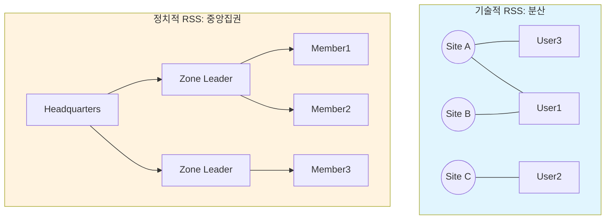

## 1. 서론: 약어(Acronym)의 충돌

IT 엔지니어에게 **RSS**는 **'Really Simple Syndication'**의 약어이자, 웹의 자유와 개방성을 상징하는 기술이다. 우리는 RSS를 통해 알고리즘의 통제 없이 원하는 정보를 수집(Aggregation)한다.

하지만 시야를 인도로 돌리면, RSS는 전혀 다른 의미를 갖는다. 그곳에서 RSS는 **'Rashtriya Swayamsevak Sangh(라슈트리야 스와얌세박 상)'**이라는 거대한 정치·사회 조직을 의미한다.

흥미로운 점은 이 두 가지 RSS가 단순히 이름만 같은 것이 아니라, **'시스템 아키텍처'**와 **'지향하는 철학'** 측면에서 완벽한 대척점에 있다는 사실이다. 본 포스팅에서는 기술적 관점에서 이 기묘한 우연과 아이러니를 분석한다.

## 2. Tech RSS: 분산과 개인의 주권 (Decentralization)

### 2.1. 아키텍처: P2P에 가까운 분산 구조
기술로서의 RSS는 **XML** 기반의 데이터 배포 프로토콜이다. 여기에는 중앙 통제 기구(Central Authority)가 존재하지 않는다.

* **Topology:** 분산형 네트워크 (Distributed Network).
* **Mechanism:** 사용자가 주도하는 **Pull** 방식. 서버는 데이터를 발행할 뿐, 누가 구독하는지 추적하지 않는다.
* **Philosophy:** **'정보 주권'**. 알고리즘이나 플랫폼의 개입 없이, 개인이 정보의 필터링 권한을 갖는다.

이는 현대의 블록체인이나 Web 3.0이 지향하는 **탈중앙화(Decentralization)** 가치와 맥을 같이 한다.

## 3. Political RSS: 통합과 집단의 규율 (Centralization)

### 3.1. 아키텍처: 강력한 계층형 트리 구조
반면, 인도의 RSS는 1925년 창설된 우익 힌두트바(Hindutva) 조직이다. 현재 인도 집권당(BJP)의 모체이기도 한 이 조직은 철저한 **중앙집권적 위계**를 갖는다.

* **Topology:** 계층형 트리 구조 (Hierarchical Tree).
* **Mechanism:** 상명하복의 **Command** 방식. 조직의 목표(힌두 국가 건설)를 위해 구성원을 일사불란하게 움직인다.
* **Philosophy:** **'집단 정체성'**. 개인의 자유보다는 조직의 규율과 힌두 문화의 통합을 최우선으로 한다.

역사적으로 이들은 간디의 독립운동과 거리를 두면서까지 내부의 종교적/문화적 통일성을 강조했다. 이는 다양성을 존중하는 '웹 생태계'와 정반대되는 '단일 사상'의 추구다.

## 4. 심층 비교 분석 (Comparative Analysis)

동일한 'RSS'라는 이름을 쓰지만, 시스템 설계 관점에서 두 대상은 완벽한 **Antonym(반의어)** 관계다.

| 비교 항목 | Tech RSS (Protocol) | Political RSS (Organization) |
| :--- | :--- | :--- |
| **핵심 가치** | **Individualism (개인주의)** | **Collectivism (집단주의)** |
| **구조 (Structure)** | Decentralized (분산형) | Centralized (중앙집권형) |
| **데이터 흐름** | Pull (사용자가 당겨옴) | Push/Command (위에서 내려옴) |
| **지향점** | 다양성, 익명성, 프라이버시 | 통일성, 소속감, 정체성 |
| **상징** | !   (주황색 아이콘) | !   (사프란 깃발) |

## 5. 결론: 이름의 역설

개발자인 우리가 매일 접하는 RSS 피드는 **'알고리즘으로부터의 해방'**을 의미한다. 우리는 그 안에서 자유롭게 정보를 선택하고, 소음을 제거하며, 나만의 타임라인을 구축한다.

그러나 지구 반대편의 수억 명에게 RSS는 **'강력한 집단으로의 소속'**을 의미한다. 그곳에서는 개인의 선택보다 조직의 깃발(Bhagwa Dhwaj) 아래 모이는 것이 더 중요한 가치가 된다.

**'개인화(Personalization)'**의 극단에 있는 기술과, **'전체주의(Totalitarianism)'**에 가까운 조직이 같은 약어를 공유한다는 것은 역사의 흥미로운 아이러니가 아닐 수 없다. 기술 용어 뒤에 숨겨진 이러한 맥락을 이해하는 것 또한, 넓은 시야를 가진 엔지니어가 되는 과정일 것이다.
